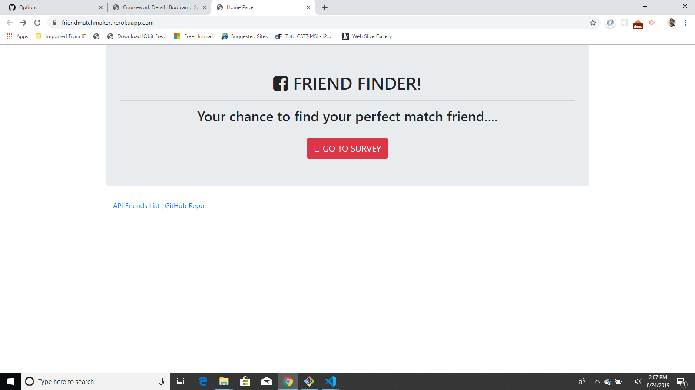
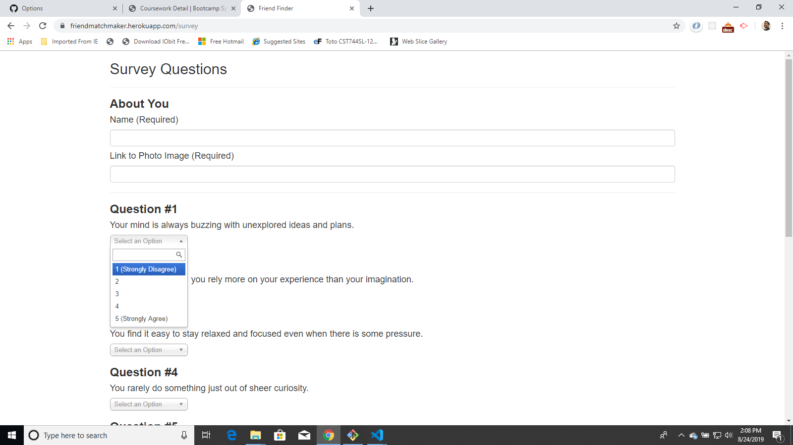

# Friendfinder

This App Asks 10 Questions via survey and rates each answer on a point scale.
The answers go from 1 to 5 ..1 being strongly disagee to 5 being strongly agree.
The App then matches up your score and finds the closest match to another friend that is in the database and displays that friends name and picture.

Built using Node and Express.js server

[Heroku Link](https://friendmatchmaker.herokuapp.com/) 

## Screen Shots
Landing Page

Survey

